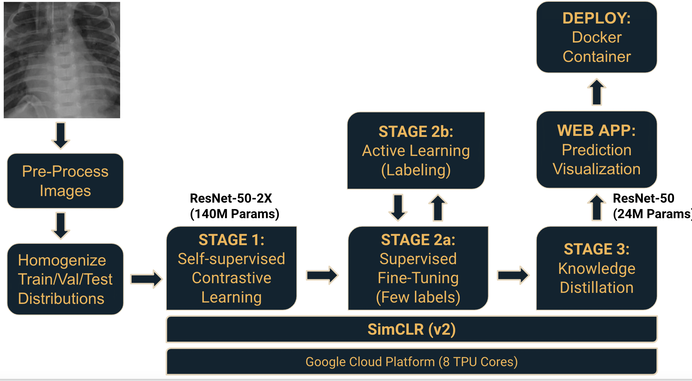

# Semi/Self-Supervised Learning on a Pediatric Pneumonia Dataset

## About
Fully supervised approaches need large, densely annotated datasets. Only hospitals that can afford to collect large annotated datasets can utilize these approaches to aid their physicians. The project goal is to utilize semi/self-supervised learning approaches to significantly reduce the need for fully labelled data. In this repo you will find the source code, along with training notebooks, and the final TensorFlow 2 saved model used to develop the web application for detecting Pediatric Pneumonia from chest X-rays.

The semi-supervised learning framework used in the project comprises of three stages: 

1. Unsupervised or self-supervised pretraining
2. Supervised fine-tuning
3. Knowledge distillation using unlabeled data

Refer to Google reserach team's paper (SimCLRv2 - Big Self-Supervised Models are Strong Semi-Supervised Learners) for more details regarding the framework used.

Resources

- [Chest X-ray Dataset](https://data.mendeley.com/datasets/rscbjbr9sj/2?__hstc=25856994.691713ea611804e2a755290a622023a7.1641825897692.1641825897692.1641825897692.1&__hssc=25856994.1.1641825897692&__hsfp=1000557398)
- [SimCLRv2 paper](https://arxiv.org/abs/2006.10029)

## ML workflow

## Acknowledgements

The base code is borrowed from [Google Research SimCLRv2](https://github.com/google-research/simclr) and has been heavily modified for the purpose of this project. We have added knowledge distillation feature along with several other changes. With these changes, knowledge distillation can now be performed on Google Cloud TPU saving significant computational time. 
